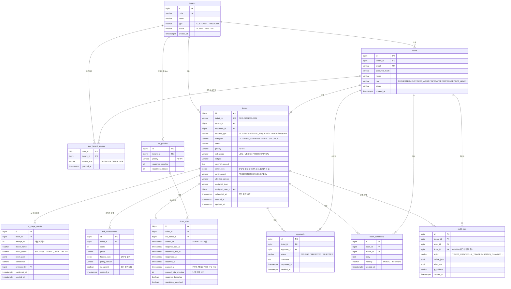

# Ordo ERD v1

> DB: PostgreSQL / 모든 고객사 데이터 테이블은 `tenant_id` 기준 논리 격리

## 1. 전체 관계도

## 2. 설계 결정 사항

| 항목 | 결정 | 이유 |
|---|---|---|
| 운영사(시스원) 표현 | `tenants.type = PROVIDER`인 테넌트로 등록 | 운영사 사용자도 `users.tenant_id`를 가지게 해서 구조를 단순화 |
| 운영사 사용자 접근 범위 | `user_tenant_access`에 등록된 고객사만 조회 | 담당하지 않는 고객사 데이터 노출 방지 |
| 유형별 추출 항목 | `tickets.detail_json`(jsonb) | 방화벽·DB·계정 요청마다 필수 항목이 달라 컬럼 고정이 비효율적 |
| AI 분석 결과 | 재분석할 때마다 새 행 추가(`attempt_no`) | 보완 전/후 AI 판단 변화를 추적 |
| 위험도 | 재계산 시 새 행 추가, `is_current`로 최신 표시 | 보완 전 9점(Critical) → 보완 후 7점(High) 이력 보존 |
| 우선순위 vs 위험등급 | `priority`(P1~P4)는 SLA용, `risk_grade`는 승인용으로 분리 | 두 개념이 섞이지 않도록 |
| SLA 시작 시점 | 티켓 `SUBMITTED` 시점 | 고객 입장의 응답 시간 기준 |
| SLA 일시정지 | `INFO_REQUIRED` 동안 정지, 누적 시간만큼 마감 연장 | 고객 보완 대기 시간이 운영사 SLA 위반으로 잡히지 않도록 |
| 감사 로그 | INSERT만 허용(UPDATE/DELETE 금지) | 위·변조 불가능한 증빙 |
| 자기 승인 방지 | `approvals.approver_id ≠ tickets.requester_id / assigned_user_id` 서버 검증 | 감사 통제 |

## 3. 우선순위 결정 규칙 (초안)

AI는 `recommendedPriority`만 추천하고, 최종 우선순위는 운영 담당자가 트리아지 확인 단계에서 확정한다.

| 우선순위 | 기준 | 첫 응답 | 해결 |
|---|---|---:|---:|
| P1 | 전체 서비스 중단 | 15분 | 4시간 |
| P2 | 핵심 기능 장애, 다수 사용자 영향 | 30분 | 8시간 |
| P3 | 일반 장애·서비스 요청·변경 | 4시간 | 3영업일 |
| P4 | 일반 문의 | 1영업일 | 5영업일 |

## 4. 인덱스 (초안)

- `tickets (tenant_id, status)` — 고객사별 목록 조회
- `tickets (assigned_user_id, status)` — 담당자별 목록
- `ticket_slas (resolution_due_at) WHERE resolved_at IS NULL` — SLA 임박 조회
- `audit_logs (ticket_id, created_at)` — 티켓별 이력 조회
- `risk_assessments (ticket_id) WHERE is_current = true`
